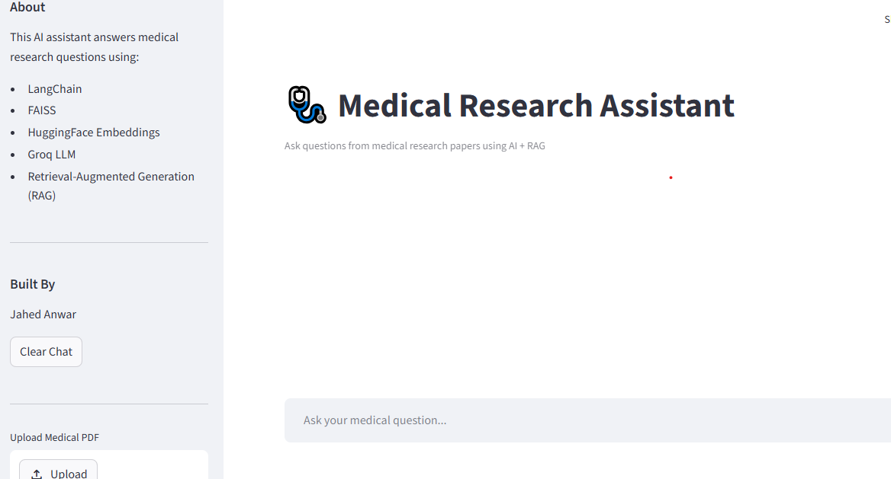
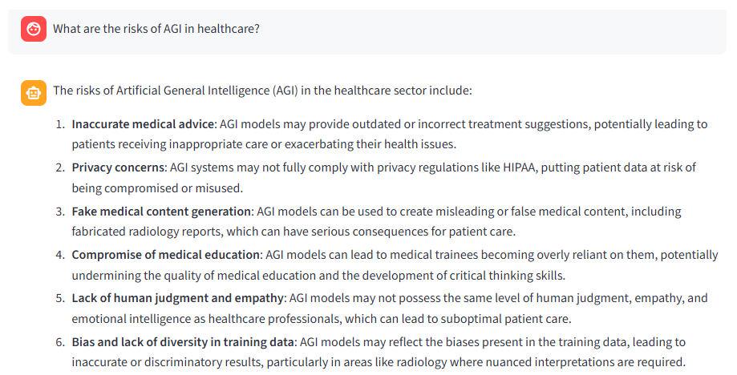
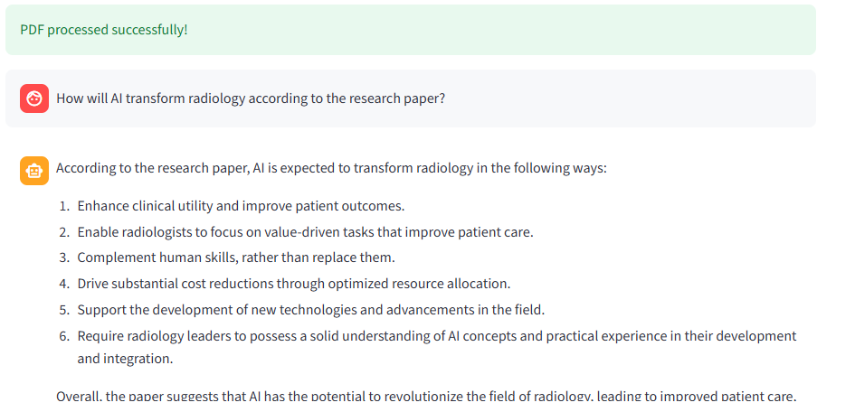

# 🩺 Medical Research RAG Assistant

An AI-powered Medical Research Assistant built using Retrieval-Augmented Generation (RAG).

This application allows users to:
- Ask medical research questions
- Upload medical PDFs
- Retrieve relevant research context
- Generate AI-powered answers using Groq LLM

---

# 🚀 Live Demo

[Open Live App](https://medical-rag-assistant-xxedplefufluaphsaogqlg.streamlit.app/)

---

# 📌 Features

# 📌 Features

# 📌 Features

✅ Medical Question Answering  
✅ Retrieval-Augmented Generation (RAG)  
✅ FAISS Vector Database  
✅ HuggingFace Embeddings  
✅ Groq LLM Integration  
✅ PDF Upload Support  
✅ OCR Support for Scanned PDFs  
✅ Citation/Source Retrieval  
✅ Conversational Memory  
✅ Persistent Chat History  
✅ Context-Aware Follow-Up Questions  
✅ Streamlit Web Application

---

# 🧠 Tech Stack

- Python
- Streamlit
- LangChain
- FAISS
- HuggingFace Sentence Transformers
- Groq API
- PyPDF
- Retrieval-Augmented Generation (RAG)

---

# ⚙️ Architecture

User Question
↓
Retriever (FAISS)
↓
Relevant Medical Chunks
↓
Groq LLM
↓
AI Response

---

# 📂 Project Structure

```bash
medical-rag-assistant/
│
├── app.py
├── requirements.txt
├── rag_pipeline.py
├── vector_store.py
├── chunk_data.py
├── prepare_data.py
├── data/
├── faiss_index/
└── README.md
```

---

# 📊 Dataset

Medical research abstracts dataset from Kaggle.

Dataset used for:
- document chunking
- vector embeddings
- semantic retrieval

---

# 🛠️ Installation

```bash
git clone https://github.com/jahed19960816/medical-rag-assistant.git

cd medical-rag-assistant

pip install -r requirements.txt

streamlit run app.py
```

---

# 🔐 Environment Variables

Create:

```bash
.streamlit/secrets.toml
```

Add:

```toml
GROQ_API_KEY = "your_api_key"
```

---

# 📸 Screenshots

## 🧠 System Architecture


---

# 📸 Screenshots

## 🏠 Home Page



---

## 🤖 AI Medical Question Answering



---

## 📄 PDF Upload Support



---

## 🔍 OCR Support for Scanned PDFs


---

## 🧠 Conversational Memory


---

---

## 💾 Persistent Chat History


# 🌟 Future Improvements
 
- Multi-document RAG
- Persistent vector database
- Hybrid search
- Citation highlighting
- Medical summarization

---

# 👨‍💻 Author

Jahed Anwar